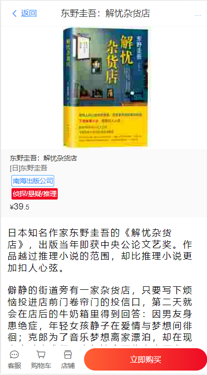
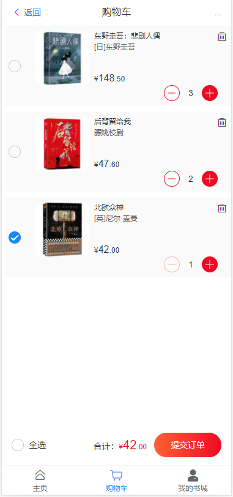
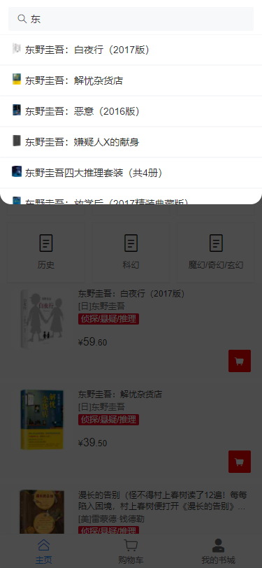

# 1、主页面




## 1. 前端

​	前端调用后端接口，利用钩子和ajax将请求的数据挂载到vue中

```js
mounted() {
    let self = this;
    this.$ajax.get_category()   //加载书籍种类
    .then(function(response){
      self.category= response.data;
    })

    this.$ajax.getAllBooks()    //加载所有书籍
    .then(function(response){
      self.category_item = response.data;
    })
  }
```

## 2.后端

​	后端controller层调用mapper层来请求数据库中的数据

```java
//mapper层
    @Select("select name from category where id = #{id}")
    public String getCategory(Integer id);

    @Select("select * from book where category = #{cid}")
    public List<Book> getCategoryBooks(Integer cid);

    @Select("select * from book")
    public List<Book> getAllBooks();

//controller层
    @PostMapping("/category")       //获取种类的名称
    public List<Category> getCategory() { return dataMapper.category(); }

    @PostMapping("/getCategoryBooks/{cid}")         //获取不同种类的书籍
    public List<Book> getCategoryBooks(@PathVariable Integer cid) {
        if (cid == 0)
            return dataMapper.getAllBooks();      //如果选中全部，则返回所有书籍
        return dataMapper.getCategoryBooks(cid);
    }
    @PostMapping("/getAllBooks" )
    public Result getAllBooks() {
        List<Book> books = dataMapper.getAllBooks();
        return Result.succeed(books);
    }
```

## 3. 购物车跳转逻辑 

​		

​		未登录时，购物车和我的书城 点击后会显示登录提示页面（如图），这是利用了vue的==路由守卫==实现的。

​		在router中注册一个前置路由守卫，这样一来，当一个导航触发时，就会执行守卫中的函数，即验证token是否合法 (过期) ，如果合法则正常跳转，如果过期或者不合法则跳转到登录导航页。

```js
router.beforeEach((to,from,next) => {    //注册一个路由守卫
  let _this = this;
  if(to.meta.requiresAuth) {
    ajax.post("/test")                  //发送一个测试请求，看token是否合法
  .then((res)=> {
    if(res.code == 100)                 //若正常返回100，说明合法，则继续跳转
    {
      next();
    }
    else {                               //否则跳转到登录导航页
      next({
        name: 'toLogin',
       // query: { redirect: to.fullPath }
      })
    }
  })
    
  }
  else {
    next()
  }
})
```

​	然后在需要路由守卫的路由对象中添加 requiresAuth: true就可以使用路由守卫了。

```js
meta: {
          requiresAuth: true
        }
```

​	**token校验代码详见第五部分的讲述。**


# 2、购物车



## 2.1 交互逻辑

### 1.加载数据

​		**前端**：

​				前端利用钩子mounted，通过ajax加载购物车数据 ： `this.$ajax.post("/searchCart")`

​		**后端逻辑：**

				1. 接受到请求后，调用`searchCart`方法。
				1. 解析token，得到当前用户名，
				1. 调用service层的方法，先找到该用户的购物车列表，遍历列表中的每一个书籍编号：找到书籍信息，然后修改其价格（单价*数量），设置书籍对象的amount属性，返回给前端一个书籍对象列表（每个书籍对象中包含价格和数量）

```java
//后端逻辑
@PostMapping("/searchCart")
public Result searchCart() {
    String name = (String) req.getAttribute("username");  //获取解析出来的用户名
    List<Book> books = cartService.getCartBooks(name);    //查找此用户的购物车数据
    return  Result.succeed(books);                        //返回书籍信息给前端
}
//service层，查询购物车，返回购物车中的书籍信息
    public List<Book> getCartBooks(String uname) {
        List<Cart> cart = cartMapper.searchCart(uname); //得到购物车列表
        List<Book> cartBook = new LinkedList<>();
        Book book = new Book();
        Iterator<Cart> it = cart.iterator();
        while(it.hasNext()) {
            Cart item = it.next();
            book = cartMapper.findBookById(item.getGid());
            book.setPrice(item.getAmount() * book.getPrice()); //修改价格：单价*数量
            book.setAmount(item.getAmount());
            cartBook.add(book);
        }
        return cartBook;
    }
//购物车类
@Data
public class Cart implements Serializable {
    private Integer gid;     //书籍的ID
    private Integer amount;  //书籍数量
}
```

###  2. 商品的增减删

​		在按钮上绑定写好的方法，当按钮点击时，通过ajax更改数据库中的数据，然后再重新请求购物车的数据，传给前端，前端再把新数据渲染到页面。这里会有一个异步问题，但是可以把请求购物车数据的方法放在then里头，避免异步带来的数据可能不准确的问题。

```js
deAmount(id) {
            this.$ajax.post("/deAmount/"+id)  //因为有token，所以传入商品ID 即可
            .then((res)=> {
                console.log(res.message);   
                this.refresh()
            })
        }, //增加，删除的方法只有调用的接口名不同，故不再一一赘述
```

### 3. 总价计算逻辑

​		用户勾选复选框之后，总价才会发生变化，利用vant中`van-checkbox-group` 提供的change事件来触发`setTotalPrice()`的调用，实现总价的计算。

​		另外，上述的方法会出现勾选复选框后，若再点击增加书籍，总价不会改变的问题，因为此时复选框没有发生变化，就触发不了`setTotalPrice()`的运行，所以，增加了一个监听器，监听book，当book数据（书的累计价格）发生变化，也会触发`setTotalPrice()`的调用，这样就可以完美执行总价的计算。

​		总价的计算，只计算勾选书籍，勾选的书籍编号放在了Result数组里头，然后遍历这些书的总价，全部加起来就是总价了。计算总价的方法如下：

```js
setTotalPrice() {
            this.totalprice = 0;
            for(var i = 0; i<this.results.length; i++) {
                this.totalprice += this.books[this.results[i]].price;
            }
        }
```

# 3、登录交互


注意，图片由==图床==加载，需要联网才能被加载出来。

## 3.1 基本逻辑

### 1、前端

​		前端发送登录请求给后端，前端根据后端的响应内容来判断是否的登录成功，若返回字段code等于100，则账号密码正确，把后端发送来的token，和用户名存储在localStorage中，方便以后使用。若code！=100，那么提示账号密码错误

```js
onSubmit(values) {
      let _this = this;
      this.$ajax.login({
        username:this.username,
        password: this.password
      })
      .then(function(res) {
        // console.log(res.message);
        if(res.code == 100) {
          console.log(res)
          localStorage.setItem("token",res.message);  //存储token
          localStorage.setItem("username",res.data.username);  //存储当前的user
          _this.$router.replace('/');
          location.reload();
        }
        else {
          alert("账号或密码错误！");
        }
      })
      .catch(err=> {
        alert("账号或密码错误！");
      })
    },
```

### 2、后端

​		后端接收前端发来的数据，查询数据库的username和password，若匹配成功，则创建一个token，一并发送给前端，前端再存储到localStorage中。

```java
public Result login(User user) {
        Result result = new Result();
        User myuser = userMapper.getByName(user.getUsername());
        if(myuser.getPassword().equals(user.getPassword())) {
            String token = JwtUtils.generateToken(myuser.getUsername());
            return Result.succeed(token,myuser);
        }
        else {
            return Result.fail("账号或密码错误");
        }
    }
```

## 3.2 敏感资源

​		敏感资源的问题，前文有提到过，利用JWT来实现的，我们在InterceptorConfig类中写 addInterceptors方法，过滤掉一些不需要登录就可以访问的接口，其他的接口没有token是访问不了的，代码如下：

```java
public class InterceptorConfig extends WebMvcConfigurationSupport {
    @Override
    public void addInterceptors(InterceptorRegistry reg) {
        reg.addInterceptor(new TokenInterceptor())
                .addPathPatterns("/**")
                .excludePathPatterns(excludePattern());
    }

    public List<String> excludePattern(){
        List<String> ret = new ArrayList<String>();
        ret.add("/login");
        ret.add("/category");
        ret.add("/getCategoryBooks/{cid}");
        ret.add("/getAllBooks");
        ret.add("/searchBook/{name}");
        ret.add("/getCNById/{id}");
        return ret;
    }
}
```

# 4、搜索



## 4.1前端设计

### 1. 功能介绍

​		搜索没有新增新的页面，而是利用了vant中的弹出层组件。这个搜索是==实时搜索==的，每当搜索框的内容发生变化，就会向后端查询数据，然后返回给搜索列表。搜索列表可以点击，点击后跳转到商品详情页，这不是敏感资源，故不用登录即可使用。

### 2. 前端逻辑

​		1. 前端代码设计：

```vue
<van-popup
      v-model="show"  :overlay-style="{marginTop: '6vh'}" round
      position="top" :style="{ height: '30%', marginTop: '6vh'}"
    > 
      <van-cell-group v-for="(item,index) in searchBooks" :key="index">
        <van-cell :value="item.name" @click="todetail(item)" :icon="'/'+item.img"></van-cell>
      </van-cell-group>
    </van-popup>
```

		2. 前端逻辑

​		前端发送请求后---> 接受到数据---> 把数据复制给vue的变量中---> 然后在页面上渲染数据

```js
data() {
    return {
        value:'',           //绑定输入框的值
        searchBooks:[],     //查找到的书籍信息，放入这个数组中
    }
}
search() {
      this.$ajax.post('/searchBook/'+this.value)
      .then((res) => {
        this.searchBooks = res.data;
      })
```

​	3. 实时搜索的实现：使用watch来监听输入框的值的变化

```js
watch: {         //实时搜索，当输入内容发生变化就向后端请求数据
    value() { 
      let _this = this;
      this.$ajax.post('/searchBook/'+this.value)
      .then((res) => {
        _this.searchBooks = res.data;
        if(_this.value.length == 0)
          _this.show = false;
        else
          _this.show = true;
      })
      .catch((err) => {
        console.log("出现了错误:"+err)
      })
    }
```

## 4.2 后端设计

​		后端比较简单，就使用sql查找了下数据，然后返回给前端

```java
@PostMapping("/searchBook/{name}")   //查找书
    public Result serachBook(@PathVariable String name) {
        name = '%'+name+'%';
        List<Book> book = dataMapper.searchBook(name);
        return Result.succeed(book);
    }

//mapper层
@Select("select * from book where name like #{name}")
    public List<Book> searchBook(String name);
```


# 5、JWT技术

## 5.1  前端的请求拦截器

​			每次请求头都携带token字段，传给后端。并进行简单错误处理。

```js
let instance = axios.create({});   
instance.interceptors.request.use(    //请求拦截器
    config=>{
        if(window.localStorage.getItem('token')!=null)
        config.headers['token'] = window.localStorage.getItem('token');
        return config;
    },
    err=>{
        Dialog({message: '请求超时'})
        return Promise.reject(err)
    }
)
```

## 5.2  后端拦截器

### 1.获取token

​		拦截器通过   `req.getHeader("token");` 请求头来获取token信息，接着判断---->>>

### 2. token校验

​		**1. 如果没有token:**     把错误写入到response中，返会给前端。

```java
if (token == null) {    //token为空
    this.writerErrorMsg(302,"请登录",resp);
    return false;
}
```

​		**2. 如果token过期：**把错误写入到response中，返会给前端。

```java
//检验并解析token，如果token过期返回null
String claims = JwtUtils.verifyToken(token);
if (claims == null) {
    this.writerErrorMsg(303,"失效，请重新登录",resp);
    return false;
}
```

​	注意：
​	其中检验token的函数放在工具类中，由于token为空，失效时会引发异常，故要添加异常处理：

```java

    public static String verifyToken( String token ) {       //传入token，我要用我的钥匙看看能不能打开这个toekn,
        try {
            Claims claims = Jwts.parser().setSigningKey(key).parseClaimsJws(token).getBody();  // 传入key,打得开我就把里头想要的数据返回
            return claims.getId();
        } catch (Exception e) {
            e.printStackTrace();
            return null;
        }
```

​		**3. 如果token验证通过**，则取出用户名，放入HttpServletRequest的上下文中，以供后续的函数使用  

```java
req.setAttribute("username",claims);
return true;
```

​		5.有一些接口需要过滤掉，比如登录接口和获取书籍信息的接口需要放行

```java
ret.add("/login");
        ret.add("/category");
        ret.add("/getCategoryBooks/{cid}");
        ret.add("/getAllBooks");
        ret.add("/searchBook/{name}");
```

## 5.3 生成token

​		我们把token的值设为了1一个小时，一个小时后自动失效。

```java
final static String key = "boboSecret";
    final static Integer ttl = 1*60*60*1000;  //一天 24*60*60*1000
    static public String generateToken( String name ) {       //传入id，对id进行加密，放在token中，（没有key的人是解不出来id的，这样就可以放心交给前端了）
        String s = Jwts.builder()
                .setHeaderParam("typ", "JWT")
                .signWith(SignatureAlgorithm.HS512, key)
                .setId(name)
                .setIssuedAt(new Date())
                .setExpiration(new Date(System.currentTimeMillis()+ttl))
                .compact();
        return s;
    }
```

## 5.4 总结

​		后端的==JWT技术的应用==，以及==集中错误处理==，统一返回等，比较艰难，虽然==JWT在前端察觉不出来==，但是花费了作者的许多==心血==（花了很多很多时间，这比收藏页难多了，有大坑），终于理解并掌握了。

# 6、商品规格

 

​		在==商品详情页==中，点击购买按钮，就会弹出商品规格选项，用户可以根据需求购买不同规格的商品，并且可以提交预定日期和备注选项。

## 1. 前端设计：

```vue
<van-sku
      v-model="show"
      :sku="sku"
      :goods="goods"
      :goods-id="goodsId"
      :hide-stock="sku.hide_stock"
      :message-config="messageConfig"
      :initial-sku="initialSku"
      buy-text="买买买"
      add-cart-text="改天再买"
    />
  </div>
```

## 2. 规格的数据结构：

```js
sku: {
        tree: [
          {
            k: '规格', // skuKeyName：规格类目名称
            k_s: 's1', // skuKeyStr：sku 组合列表（下方 list）中当前类目对应的 key 值，value 值会是从属于当前类目的一个规格值 id
            v: [
              {
                id: '1', // skuValueId：规格值 id
                name: '官方推荐', // skuValueName：规格值名称
                imgUrl: '/'+this.$route.params.page.img, // 规格类目图片，只有第一个规格类目可以定义图片
                previewImgUrl: '/'+this.$route.params.page.img, // 用于预览显示的规格类目图片
              },
              {
                id: '2', // skuValueId：规格值 id
                name: '豪华版', // skuValueName：规格值名称
                imgUrl: '/'+this.$route.params.page.img, // 规格类目图片，只有第一个规格类目可以定义图片
                previewImgUrl: '/'+this.$route.params.page.img, // 用于预览显示的规格类目图片
              },

            ],
            largeImageMode: false, //  是否展示大图模式
          },

        ],
        // 所有 sku 的组合列表，比如红色、M 码为一个 sku 组合，红色、S 码为另一个组合
        list: [
          {
            id: 2259, // skuId
            s1: '1', // 规格类目 k_s 为 s1 的对应规格值 id
            price: this.$route.params.page.price * 100, 
            stock_num: 110
          },
          {
            id: 2258,
            s1: '2', 
            price: (this.$route.params.page.price +20)* 100, 
            stock_num: 40 
          },
        ],
        
        price: this.$route.params.page.price, // 默认价格（单位元）
        stock_num: 227, // 商品总库存
        collection_id: 2259, // 无规格商品 skuId 取 collection_id，否则取所选 sku 组合对应的 id
        none_sku: false, // 是否无规格商品
        messages: [
          {
            // 商品留言
            datetime: '1', 
            name: '预定日期',
            type: 'date', 
            required: '0', 
          },
          {
            // 商品留言
            datetime: '1', 
            multiple: '1', 
            name: '备注', 
            type: 'text', 
            required: '0', // 是否必填 '1' 表示必填
            extraDesc: '唉要大声说出来！'  // 附加描述文案
          }
        ],
        hide_stock: false // 是否隐藏剩余库存
      },
      goods: {
        picture: '/'+this.$route.params.page.img
      },
```


